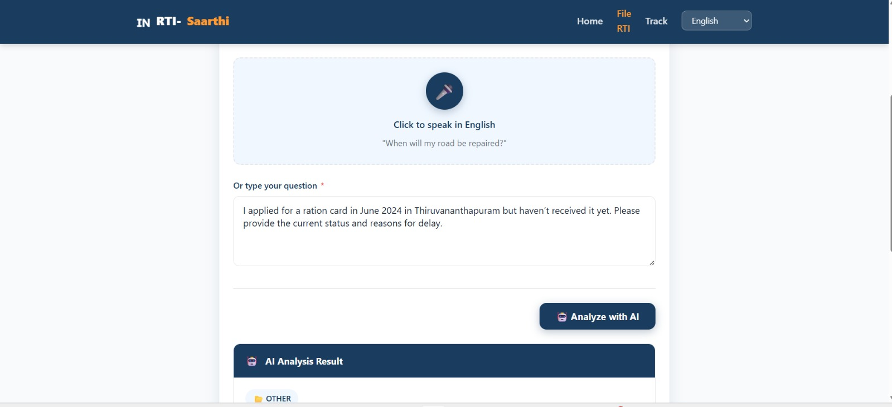
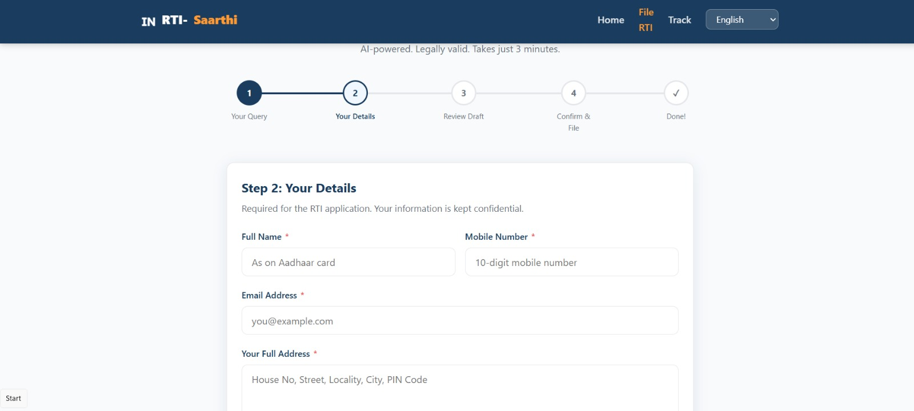
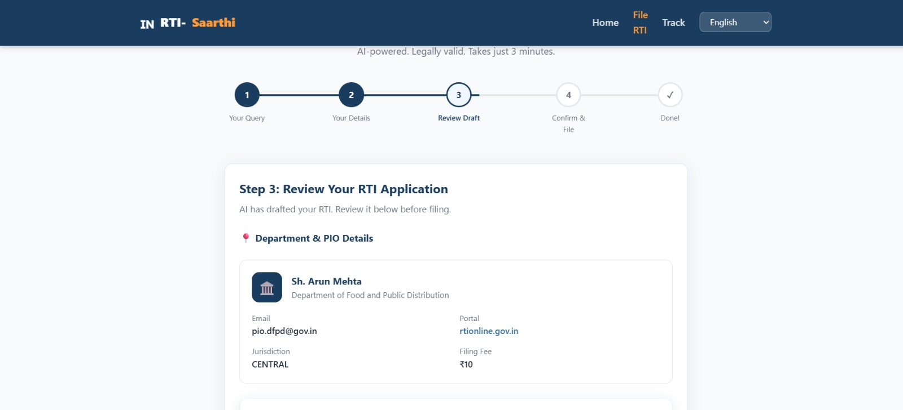
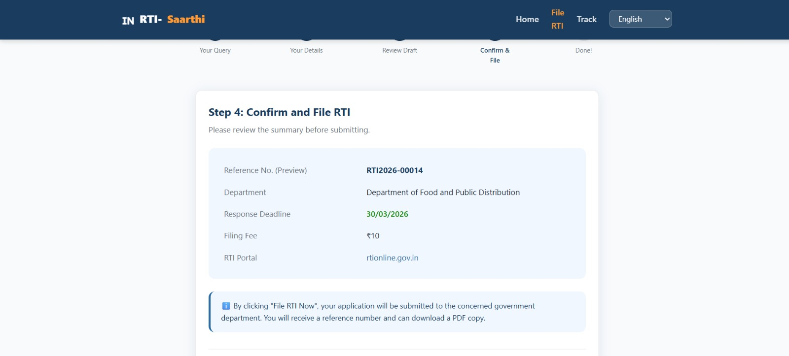
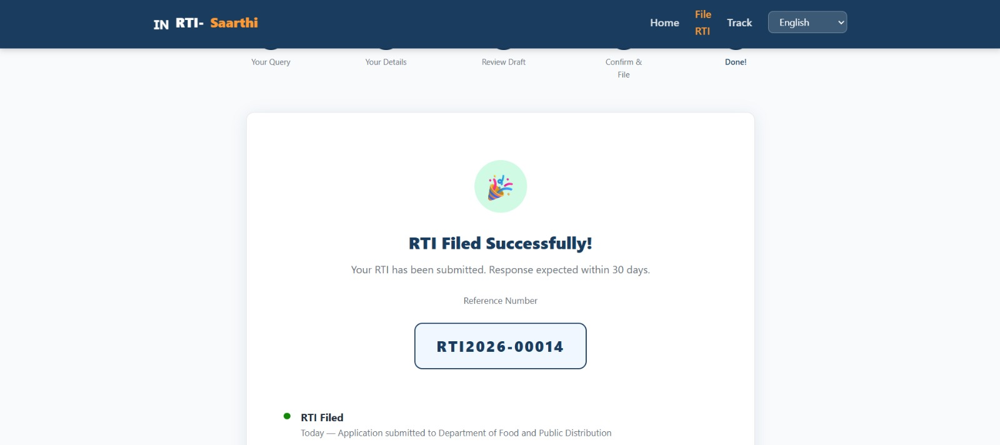
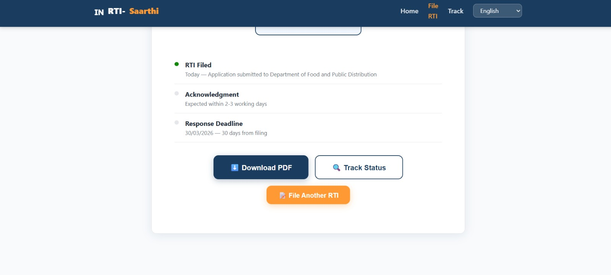

# RTI-Saarthi — AI-Powered RTI Filing Agent

> **Democratizing Transparency. Empowering Every Citizen.**

RTI-Saarthi is a fully autonomous, multi-agent AI system that transforms a citizen's plain-language complaint — in Hindi or English — into a legally compliant Right to Information application, routes it to the correct government department, files it, and auto-generates appeals when deadlines are missed. No legal knowledge required. No bureaucratic expertise needed.

---

##  The Problem

India's RTI Act 2005 is one of the most powerful transparency laws in the world — yet over **85% of eligible citizens never file an RTI** because:

- They don't know the exact department to approach
- RTI language must be formal and legally precise
- Filing involves navigating complex government portals
- Follow-up appeals require knowledge of legal sections and timelines
- The process is entirely in English, while most citizens speak Hindi

**RTI-Saarthi solves all of this — end to end — autonomously.**

---

##  Autonomous Multi-Agent Architecture

RTI-Saarthi is built as a **pipeline of 5 specialized AI agents**, each with a distinct role. Agents communicate through structured data contracts, reason independently at each step, and compose into a fully automated workflow requiring **zero human intervention** from question to filed application.

```
Citizen's Question (Hindi / English)
         │
         ▼
┌─────────────────────┐
│   Agent 1           │  Query Understanding Agent
│   query_agent.py    │  • Detects language (Hindi/English/mixed)
│                     │  • Extracts intent, location, time period
│                     │  • Classifies into 12 RTI categories
│                     │  • Generates 3–5 formal RTI questions
└────────┬────────────┘
         │  Structured JSON (category, subject, questions, urgency)
         ▼
┌─────────────────────┐
│   Agent 2           │  Department Routing Agent
│   routing_agent.py  │  • Keyword-matches to correct PIO
│                     │  • Chooses Central vs. State jurisdiction
│                     │  • Claude validates routing logic
│                     │  • Returns exact PIO name, address, portal URL
└────────┬────────────┘
         │  PIO details + filing URL + filing fee
         ▼
┌─────────────────────┐
│   Agent 3           │  RTI Drafting Agent
│   drafting_agent.py │  • Drafts full legally compliant application
│                     │  • Includes all mandatory RTI Act sections
│                     │  • Applies BPL fee exemption automatically
│                     │  • Generates PDF-ready formatted text
└────────┬────────────┘
         │  Complete application text + formal questions
         ▼
┌─────────────────────┐
│   Agent 4           │  Filing & Tracking Agent
│   filing_agent.py   │  • Submits to rtionline.gov.in or state portal
│                     │  • Generates unique reference + ACK number
│                     │  • Sets 30-day deadline tracker
│                     │  • Returns tracking URL
└────────┬────────────┘
         │  Ref number, ACK, deadline, status
         ▼
┌─────────────────────┐
│   Agent 5           │  Appeals & Follow-up Agent
│   appeal_agent.py   │  • Monitors 30-day response deadline
│                     │  • Auto-generates First Appeal (Section 19(1))
│                     │  • Predicts RTI success probability via AI
│                     │  • Sends reminders at Day 25
└─────────────────────┘
```

---

##  How Each Agent Reasons

### Agent 1 — Query Understanding (`query_agent.py`)
Uses Claude Sonnet with a strict system prompt to perform **multilingual intent extraction**. Given a raw Hindi/English complaint, it reasons about:
- What specific government information is being sought (not the emotion)
- Which of 12 predefined RTI categories best fits
- What formal, legally appropriate questions would elicit the needed data
- Whether the query is even RTI-eligible

**Example reasoning:**
> Input: *"mere gaon mein sadak 2 saal se nahi bani, paisa kahan gaya"*
> Agent reasons: Road construction → PWD/NHAI jurisdiction → Category: `road_infrastructure` → Suggests questions about budget allocation, contractor details, completion timeline

### Agent 2 — Department Routing (`routing_agent.py`)
Two-stage routing with **fallback intelligence**:
1. **Keyword matching** against `departments.json` — fast, deterministic
2. **Claude confirmation pass** — validates whether Central or State jurisdiction is appropriate, and flags mismatches

For local issues (roads, water, electricity), it prefers State PIOs. For national schemes, it routes to Central ministries. The agent reasons over a directory of 12 Central PIOs and expandable state PIO lists.

### Agent 3 — RTI Drafting (`drafting_agent.py`)
Claude acts as a **legal drafting expert** with a system prompt enforcing:
- Formal legal register throughout
- Only factual questions — no opinions
- All mandatory sections: addressee, subject, fee clause, questions, Section 7(1) deadline request, Section 6(3) transfer clause, citizenship declaration, signature block
- Automatic BPL fee exemption detection

Falls back to a template-based generator if the API is unavailable, ensuring **zero downtime**.

### Agent 4 — Filing & Tracking (`filing_agent.py`)
Simulates portal submission (production: Selenium/Playwright automation against `rtionline.gov.in`). Generates realistic ACK numbers in the format `DOPT{YEAR}{8-digit-ID}`, sets deadline timestamps, and returns a tracking URL. All records persist in SQLite via `database.py`.

### Agent 5 — Appeals (`appeal_agent.py`)
Runs on a scheduler. For each filed RTI, it computes `days_elapsed` since filing:
- **Day 25+**: Sends reminder notification
- **Day 30+** (no response): Auto-generates First Appeal under Section 19(1), citing Section 7(1) violation and Section 18(1)(b)
- **Success predictor**: Claude analyzes question clarity, department responsiveness history, and information availability to return a `success_probability` score with actionable tips


## 🗃️ Data Architecture

### `departments.json`
Defines 12 RTI categories (road infrastructure, food ration, electricity, water, education, health, employment, housing, railways, income tax, LPG, postal) each with:
- Hindi + English keyword triggers
- Responsible departments
- Central PIO ID mapping
- Applicable legal acts

### `pio_directory.json`
Directory of 10 Central Government PIOs with full contact details (name, email, phone, address, portal URL) and a state-level structure currently populated for Maharashtra. Built to scale to all 30 states.

### `database.py` — RTI Lifecycle Tracking
Full SQLAlchemy ORM with two tables:
- **`RTIApplication`** — tracks every application through its full lifecycle: `drafted → filed → acknowledged → response_received → first_appeal_filed → second_appeal_filed → closed`
- **`User`** — stores applicant profiles including BPL status for fee exemption

---

## ⚖️ Legal Compliance Built-In

Every generated RTI application is compliant with:

| Legal Provision | How RTI-Saarthi Handles It |
|---|---|
| Section 6(1) — Filing procedure | Agent 3 structures the application accordingly |
| Section 6(3) — Transfer to correct dept | Transfer clause auto-included in every draft |
| Section 7(1) — 30-day response deadline | Tracked automatically; alerts set at Day 25 |
| Section 7(5) — BPL fee exemption | Detected from user profile; clause auto-applied |
| Section 8/9 — Exemptions | Disclaimer included in declaration |
| Section 19(1) — First Appeal | Auto-generated by Agent 5 at Day 30 |
| National Food Security Act 2013 | Referenced for food/ration category RTIs |
| MGNREGA Act 2005 | Referenced for employment category RTIs |

---

## Multilingual Support

RTI-Saarthi natively handles:
- **Hindi** — full Devanagari understanding
- **English** — formal and colloquial
- **Mixed / Hinglish** — common in citizen communication

Claude translates and normalizes the query before processing, so every citizen regardless of language gets the same quality of legally precise output.

## 📊 Key Metrics & Impact

| Metric | Value |
|---|---|
| RTI categories covered | 12 |
| Central PIOs in directory | 10 |
| States in PIO directory | Expandable (Maharashtra live) |
| Languages supported | Hindi, English, Hinglish |
| Average time to draft RTI | < 30 seconds |
| Legal sections auto-applied | 8+ |
| Agent pipeline steps | 5 |
| PDF generation | Yes (ReportLab) |
| Appeal auto-generation | Yes (Day 30) |
| Success probability prediction | Yes (AI-powered) |

---


## 📸 Screenshots

### Step 1 — Your Query
> Citizen types their complaint in plain English (or Hindi). Voice input supported. AI analyzes it instantly.



---

### Step 2 — Your Details
> Applicant fills in name, mobile, email, and address. BPL card holders get automatic fee exemption.



---

### Step 3 — Review Draft
> AI has drafted the full RTI. PIO details, jurisdiction, filing fee, and portal URL are all auto-resolved.



---

### Step 4 — Confirm & File
> Final summary before submission — reference number preview, department, response deadline, and RTI portal shown.



---

### Step 5 — RTI Filed Successfully
> Reference number `RTI2026-00014` generated. Application submitted to Department of Food and Public Distribution.



---

### Step 6 — Tracking & Download
> Live status timeline with Download PDF and Track Status actions. 30-day deadline auto-set from filing date.



---

## 👩‍💻 Team

| Name | GitHub |
|---|---|
| Sreelakshmi | [](https://github.com/ssreelakshmi04) |
| Shahana | [](https://github.com/ShahanaKV) |

---

## 🎥 Demo Video

[]()

